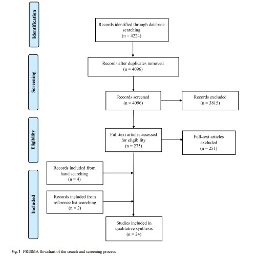

December 12, 2023 

**Reading Homework:** Using Simulation as an Investigative Methodology in Researching Competencies of Clinical Social Work Practice: A Scoping Review (K. Asakura et al.)
Emphasis: Charting the Data 

Process/Steps for literature review:
1. i.d. research questions
2. i.d. relevant studies
3. selecting studies based on inclusion and exclusion criteria
4. charting data
5. collating/summarize/report results
